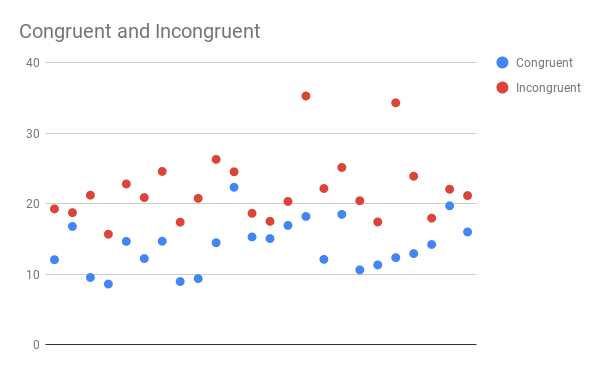

## Test a Perceptual Phenomenon

### Question 1: Identify variables in the experiment
>- Independent variable: ~~word condition (congruent or incongruent)~~ the congruency of the color and text
>- Dependent varaible: ~~Time to name the ink colors~~ duration (time) to recognise the ink colors

*Thanks for the reviewer's suggestions to improve my expressions*

### Question 2a: Establish hypotheses
>We define μcongruent as the population mean of duration to name the ink colors in congruent word condition and μincongruent as the population mean of the duration to name the ink colors in incongruent word condition.
>
>- Null hypotheses: It doesn't take longer time to name the ink colors in the incongruent word condition than it does in the congruent word condition.
>
>  H0 : μincongruent <= μcongruent
>
>- Alternative hypotheses: It takes longer time to name the ink colors in the incongruent word condition than it does in the congruent word condition.
>
>  HA : μincongruent > μcongruent

### Question 2b: Establish a statistical test
>Because we don't know the mean and standard deviation of the population we choose positive direction, one-tailed dependent t test to decide to accept or reject the null hypotheses based on these assumptions:
>
>- the distribution of the duration to name the ink colors is normal
>- the incongruent word condition has impact on the time of naming the ink colors, so we use dependent t test on the same samples (participants) with different conditions
>- we guess the incongruent word condition may slow down the speed of naming the ink colors, so we choose positive (longer time) direction, one-tailed t test

### Question 3: Report descriptive statistics
>- In congruent word condition
>  - Centrality
>    - Sample mean: 14.05
>  - Variability
>    - Standard deviation: 3.56
>- In incongruent word condition
>  - Centrality
>    - Sample mean: 22.02
>  - Variability
>    - Standard deviation: 4.80
>- The difference of two conditions
>  - Centrality
>    - Difference of the sample mean: 7.96
>  - Variability
>    - Standard deviation of the difference: 4.86

### Question 4: Plot the data
>
>
>We can see the time to name the ink colors in incongruent word condition is longer than that in congruent condition for all participants. So I think the incongruent condition will increase the reaction time.

### Question 5: Perform the statistical test and interpret your results
>The result of given test:
>
>- t(23)=8.02, p<0.0001,one-tailed
>
>If we choose 0.05 (5%) as the α level since p is less than 0.05 we reject the null hypotheses. 
>
>I performed a test on 6 participants and get the following results:
>
>- Number of samples: 6
>- Degrees of freedom: 5
>- Difference of sample mean: 27.32
>- Standard deviation of the difference: 20.33
>- t value: 3.29
>- p value: 0.01085
>
>The p is less than 0.05 too.
>
>So I think these results show that the incongruent word condition statistically significantly slow down the speed of naming the ink colors.

### List of websites I referred

- https://www.graphpad.com/quickcalcs/
- https://docs.google.com/spreadsheets
